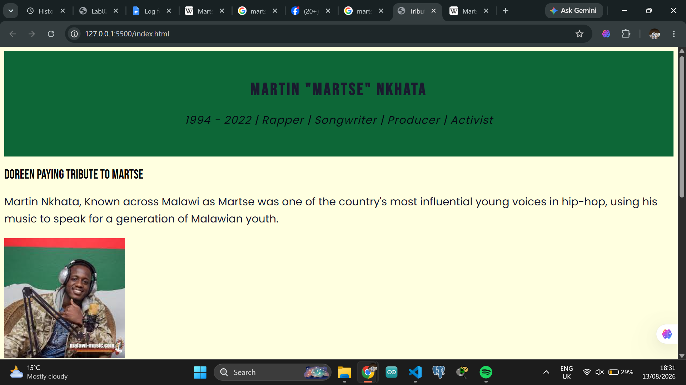

#Lab 2 - Error Log
Student Name: Doreen Providence Abel
Student ID: BECE/21/SS/001
Date: 13th August 2026
Lab Session: 4:00PM - 6:30PM

**What I learned from this:**
A colour "palette" means defining colours once and reusing them, not just picking values that look good — that's the whole point of CSS custom properties.

---

## Error 1

Task I was working on: Task 1 (Connecting external CSS) / Git setup

What I was trying to do:
Push my committed work to GitHub Classroom with git push.

**The exact error or problem I saw:**
[Paste your exact terminal output here — likely something like error: src refspec master does not match any or failed to push some refs.] The underlying issue was a conflict between my local branch name (master) and the remote repository's default branch (main), so Git couldn't tell which branch to push to.

Steps I took to fix it:
1. Ran git branch to check what my local branch was actually called.
2. Renamed it to match the remote: git branch -M main.
3. Re-ran git push -u origin mai, which set the tracking correctly and pushed successfully.

What I learned from this:
Git's default branch name depends on local configuration, not the remote — it's worth checking git branch and git remote -v before pushing to a new repo instead of assuming they match.

